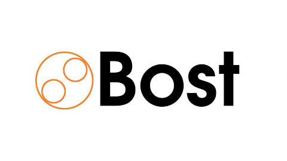

# Bost
Minimal Discord Bot which uses plugins to extend it's capabilities

## Disclaimer
Be very careful when adding plugins to the bot. The plugins have the same rights as the bot on your server and could
cause some trouble. We are not responsible for plugins made by the community.

## Default plugins
- Music - A plugin to make the bot play music in a voice channel.
- more to come...

## How to compile
### Compile the bot
Just use the command `mvn install -pl :Bot -am`. A file Bot-{version}-jar-with-dependencies.jar has been created in
[Bot/out/](Bot/out) and it has been installed in the local repo.

### Compile the plugins
Run the command `mvn install -pl :artifactId -am` for each plugin after replacing `artifactId` by the corresponding
plugin's artifactId. The `artifactId` of each plugin can be found in the `<artifactId>` tag of each plugin's pom.xml.

## Install plugins
After running the bot, the directory `plugins` must have been created. Place the plugins' jar file in it. Your plugins
are installed. Bost will load them when you start it.

## How to create a plugin
Start by creating a Maven project. Install the bot in the local repo by following [Compile the bot](#compile-the-bot) then add Bost as a
dependency to your project. Here's an example of pom.xml:
```xml
<?xml version="1.0" encoding="UTF-8"?>
<project xmlns="http://maven.apache.org/POM/4.0.0"
         xmlns:xsi="http://www.w3.org/2001/XMLSchema-instance"
         xsi:schemaLocation="http://maven.apache.org/POM/4.0.0 http://maven.apache.org/xsd/maven-4.0.0.xsd">

    <packaging>jar</packaging>
    <version>1.0</version>
    <modelVersion>4.0.0</modelVersion>

    <groupId>your.groupid</groupId>
    <artifactId>yourArtifactId</artifactId>

    <build>
        <plugins>
            <plugin>
                <groupId>org.apache.maven.plugins</groupId>
                <artifactId>maven-compiler-plugin</artifactId>
            </plugin>
            <plugin>
                <groupId>org.apache.maven.plugins</groupId>
                <artifactId>maven-assembly-plugin</artifactId>
            </plugin>
        </plugins>
    </build>

    <dependencies>
        <dependency>
            <groupId>fr.paragoumba.bost</groupId>
            <artifactId>Bot</artifactId>
            <scope>provided</scope>
        </dependency>
    </dependencies>
</project>
```
Your main class must extend Plugin. The entrypoint of each plugin is onEnable. For your plugin to be valid, there must
be a file named plugin.yml containing at least the name of your plugin and the name of the main class with its package.
Here's an example of plugin.yml:
```yaml
name: YourPlugin
main: your.package.MainClassOfYourPlugin
version: "0.1"
author: Paragoumba
```
You can validate your file plugin.yml with the JSON schema [bost-plugin-schema.json](bost-plugin-schema.json).